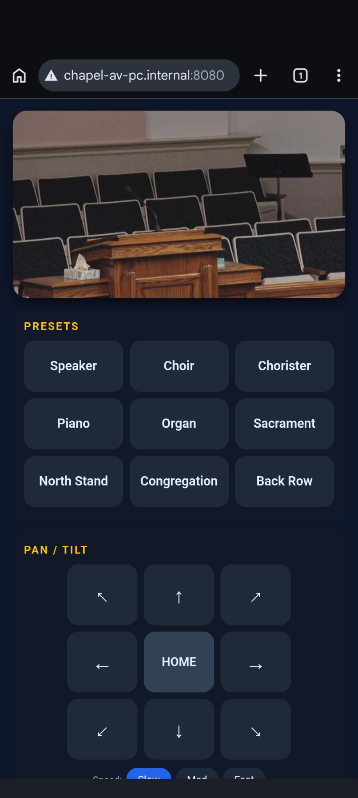
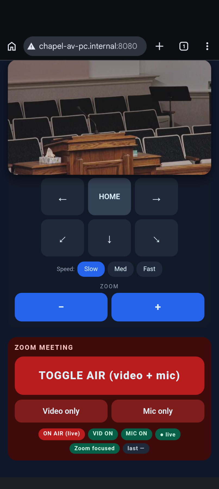

# pew-ptz

**Run a broadcast from a phone in your seat.** A small, self-hosted web app
that turns any **VISCA-over-IP PTZ camera** into something you can drive from
the couch / pew / back row, and gives you bidirectional **Zoom mute & video
toggles** that actually work from a phone.

No cloud, no accounts, no app to install. Connect to the LAN, open a URL on
your phone, run the show.

<p align="center">
  
  
</p>

---

## Why this exists

You're operating a broadcast from somewhere that isn't a control booth. A
pew during a service. A folding chair at a conference. The back of a small
hall. You don't want to walk to a PC every time you need to mute Zoom or
nudge the camera.

Two things make that miserable today:

1. **PTZ remotes are line-of-sight IR.** Sit in the wrong spot or have
   someone slide in front of you and the remote stops working.
2. **Zoom mobile won't let a co-host *unmute* a different participant.** It
   *will* mute / stop video — so the moment you cut the broadcast, your only
   way back on the air is to physically walk to the broadcast PC. Mid-event,
   that's exactly the wrong time to be moving around.

This app collapses both jobs onto one phone screen on the local Wi-Fi:

1. **PTZ over the LAN, not IR** — sit anywhere with line-of-sight to the
   Wi-Fi router, not to the camera. Hold-to-move D-pad, hold-to-zoom,
   named presets, and a sticky live preview pinned to the top of the page.
2. **Bidirectional Zoom toggles** — the server runs on the broadcast PC and
   sends Zoom's own keyboard shortcuts (`Alt+V`, `Alt+A`) to the foreground
   Zoom window. They're toggles, so the same button takes you off-air *and*
   brings you back.
3. **Ground-truth Zoom state** — Windows UI Automation reads the actual
   Zoom toolbar so the on-air pills can't drift out of sync with reality.

Everything is on the local network. Nothing leaves the building.

---

## Compatibility

### Cameras

Anything that speaks **VISCA-over-IP** (the Sony-style protocol most
broadcast PTZs implement). Confirmed or expected to work:

- ClearTouch RL500 *(the reference deployment)*
- PTZOptics Move/Studio Pro/Eagle/Hive series
- Sony BRC / SRG series
- AVer CAM/PTC series
- Marshall CV-series PTZ
- HuddleCam HC series
- BirdDog PTZ family
- Lumens VC-A series
- Most Chinese OEM PTZs sold under various brands

The packet builders in [`pew_ptz/visca.py`](pew_ptz/visca.py) implement the
spec verbatim — they don't carry vendor extensions. As long as your camera
accepts VISCA on UDP 52381, the camera control will work.

If your firmware uses **TCP 5678** for VISCA instead of UDP 52381 (some
older PTZOptics, some OEM rebrands), or only exposes an HTTP CGI control
surface, [`docs/ptz-cameras.md`](docs/ptz-cameras.md) has the swap recipes.

### Live preview

The preview tile uses an HTTP snapshot URL (default `/snapshot.jpg`) polled
~2.5 fps from the phone. Vendor paths vary — set `PEW_PTZ_CAMERA_SNAPSHOT_PATH`
to whatever your camera uses. Common ones:

| Vendor / firmware | Snapshot path |
|---|---|
| ClearTouch RL500, many OEMs | `/snapshot.jpg` |
| Hikvision-style ISAPI | `/Streaming/channels/1/picture` |
| Generic CGI | `/cgi-bin/snapshot.cgi` |
| Axis | `/axis-cgi/jpg/image.cgi` |

If your camera only exposes RTSP, see
[`docs/ptz-cameras.md`](docs/ptz-cameras.md#cameras-without-an-http-snapshot) —
the short version is "browsers can't play RTSP, you'll need a small
transcoder like MediaMTX, and it's out of scope for this project."

### Host PC (the Zoom PC)

- **Windows** is the primary target. The included installer
  ([`scripts/install.ps1`](scripts/install.ps1)) ensures Python 3.14 via
  winget, sets up a venv, opens the firewall, and registers a per-user
  Scheduled Task. UI-Automation-based Zoom state readback is Windows-only.
- **macOS / Linux** work for camera control but the Zoom hotkey injection
  needs swapping (`Cmd+Shift+V`/`Cmd+Shift+A` on macOS) and you lose the
  state readback. See
  [`docs/architecture.md#porting-to-macos-or-linux`](docs/architecture.md#porting-to-macos-or-linux).

---

## Install (Windows, unattended)

```powershell
# 1. Get the code
git clone https://github.com/sknnr-chad/pew-ptz.git C:\tools\pew-ptz

# 2. Run the installer as Administrator
cd C:\tools\pew-ptz
Set-ExecutionPolicy -Scope Process -ExecutionPolicy Bypass -Force
.\scripts\install.ps1
```

[`scripts/install.ps1`](scripts/install.ps1) is idempotent. It will:

- Install Python 3.14 via winget if missing
- Create `.venv` and install the package
- Open Windows Firewall on TCP 8080 (Private profile only)
- Register a Scheduled Task **At logon of the operator user** with
  restart-on-failure (runs under the user session so `pynput` can reach Zoom)
- Drop a desktop shortcut to `http://localhost:8080`
- Prompt for the initial **user** and **admin** PINs (see [Authentication](#authentication)).
  On re-runs, offers a Keep/Replace menu. Pass `-PinSetup Skip` to leave PINs
  untouched, `-PinSetup Force` to re-prompt for both, or `-NoAuth` to run open
  with no PIN lock (trusted-LAN deployments).

Defaults match the reference deployment: install dir `C:\tools\pew-ptz`,
operator user `Chapel-AV`. Override with
`-InstallDir`, `-TaskUser`, `-Port` if you need to.

After install, log in as the operator user (or reboot if auto-login is set)
and hit `http://<host-pc-lan-ip>:8080` from the operator's phone on the
same Wi-Fi.

**Required Zoom setting (one-time):**
**Settings → Meetings & Webinars → Controls → "Keep meeting controls visible"**.
Without this the toolbar auto-hides and the UIA-based state reader can't see
the mute/video buttons. The pills will fall back to optimistic mode.

To remove: `.\scripts\uninstall.ps1` (leaves the source tree in place).

### Just want to try it from a laptop

```powershell
git clone https://github.com/sknnr-chad/pew-ptz.git
cd pew-ptz
py -m venv .venv
.\.venv\Scripts\Activate.ps1
pip install -e .
$env:PEW_PTZ_CAMERA_IP = "192.168.1.50"   # your camera's LAN IP
pew-ptz
```

Then on the phone: `http://<your-laptop-ip>:8080`. The Zoom Meeting card
will say "keyboard unavailable" — fine, camera control still works.

---

## Configuration

All config is environment variables. No config file, no secrets.

| Var | Default | Notes |
|---|---|---|
| `PEW_PTZ_CAMERA_IP` | `192.168.100.88` | Camera's LAN address |
| `PEW_PTZ_VISCA_PORT` | `52381` | VISCA-over-IP UDP port |
| `PEW_PTZ_SERVER_PORT` | `8080` | Flask listen port |
| `PEW_PTZ_CAMERA_SNAPSHOT_PATH` | `/snapshot.jpg` | HTTP path on the camera that returns a JPEG (see Compatibility table above) |
| `PEW_PTZ_PRESETS` | (9 chapel presets) | Comma-separated. Slot N on the camera maps to the Nth name (1-indexed). Example: `Wide,Speaker,Audience,Stage Left,Stage Right` |
| `PEW_PTZ_LOG_DIR` | unset | If set, writes `server.log` (rotating, 1 MB × 5) here. The installer points this at `<InstallDir>\logs`. |
| `PEW_PTZ_SKIP_FOCUS_CHECK` | unset | Set to `1` to bypass the "Zoom must be foreground" guard. Useful for UI testing on a dev box without Zoom. |
| `PEW_PTZ_STATE_DIR` | cwd | Where `auth.json` lives. The installer points this at `<InstallDir>`. |
| `PEW_PTZ_AUTH_SKIN` | `steampunk` | Which skin renders the lock screen. See `pew_ptz/skins/` for available skins. |
| `PEW_PTZ_SESSION_HOURS` | `8` | Absolute session lifetime. A Sunday block fits comfortably. |
| `PEW_PTZ_AUTH_DISABLED` | unset | Set to `1` to run open (no PIN lock). The installer wires this up for you when you pass `-NoAuth` or answer "n" to the enable prompt. The server logs a loud warning at startup. |

---

## Authentication

The app gates access behind a steampunk-themed 4-digit lock with two roles:

- **user** — full camera + Zoom control (the operator's PIN)
- **admin** — same plus the ability to change either PIN and the
  Zoom UIA debug endpoint

PIN entry is a horizontal row of brass dials; auto-submits when all four
settle on a digit. Wrong PIN shakes the plate and resets. Five wrong
attempts from an IP triggers a 30-second cooldown.

**Auth is optional.** On a fully trusted home LAN you can run open with no
lock screen — pass `-NoAuth` to the installer, or answer "n" to its enable
prompt. The choice sticks across re-runs of the installer (it reads the
existing `launch.cmd`); switch back to PINs later with `-PinSetup Force`.
Without the installer, just set `PEW_PTZ_AUTH_DISABLED=1` in the
environment.

### First-time PIN setup

The installer prompts for both PINs on first run. On re-runs it shows a
Keep / Replace menu — pick `K` to leave them alone, `B` to replace both,
or `U`/`A` to rotate just one.

You can also set or rotate PINs manually:

```powershell
cd C:\tools\pew-ptz
$env:PEW_PTZ_STATE_DIR = "C:\tools\pew-ptz"
.\.venv\Scripts\python.exe -m pew_ptz.auth set --role user
.\.venv\Scripts\python.exe -m pew_ptz.auth set --role admin
.\.venv\Scripts\python.exe -m pew_ptz.auth status   # show last-changed dates
```

PINs never appear in process arguments or shell history — the CLI prompts
via `getpass`.

### Rotating PINs from the phone (admin only)

Log in with the admin PIN, tap the gear icon in the top-right, choose
**Change user PIN** or **Change admin PIN**. The flow asks for the current
admin PIN once (defense against an unlocked tablet on a counter), then
asks for the new PIN. Other phones with active sessions stay logged in —
PIN rotation doesn't invalidate the session secret.

### Recovery — "I forgot the admin PIN"

On the chapel PC:

```powershell
cd C:\tools\pew-ptz
$env:PEW_PTZ_STATE_DIR = "C:\tools\pew-ptz"
.\.venv\Scripts\python.exe -m pew_ptz.auth reset
.\.venv\Scripts\python.exe -m pew_ptz.auth set --role user
.\.venv\Scripts\python.exe -m pew_ptz.auth set --role admin
```

This deletes `auth.json` and lets you re-seed both PINs. The session
secret is regenerated, so any logged-in phones will be bounced to the lock.

### What's NOT gated

The camera's live snapshot stream goes **directly from the phone to the
camera** (see the `` in the UI).
Anyone on the LAN who knows the camera IP can pull frames whether or not
they have a PIN. The camera was already reachable directly; proxying it
through Flask would add Python in the 400ms snapshot hot path for no
real gain in a LAN-only deployment. If you care about gating the video,
restrict the camera's own network access.

`/healthz` is also unauthenticated so external monitoring can hit it. It
discloses camera IP, foreground process, and keyboard status — fine on a
trusted LAN.

---

## Features

- **Sticky live preview** — `` polls the camera's snapshot URL ~2.5 fps
  and floats at the top of the page as the operator scrolls.
- **D-pad** with diagonals, **hold-to-move** (release = stop) at slow / med /
  fast. Defaults to slow — easier to land a frame on a person.
- **HOME** button recalls preset 1 (typically "Speaker") — the most-used
  framing.
- **Up to N named presets** — recall on tap. The web UI is recall-only by
  design (no `/preset/set` HTTP route) so an operator can't accidentally
  overwrite a preset mid-event. Train them via the camera's web UI or IR
  remote.
- **Hold-to-zoom** at a deliberately slow default (2/7).
- **Autofocus is asserted on at server startup** — the camera can't get
  stuck out of focus after a power-cycle or stray IR poke.
- **One-tap TOGGLE AIR** (video + mic together), green when off-air, red
  when on-air, plus separate Video / Mic toggles for granular use.
- **Ground-truth Zoom state via UI Automation (Windows)** — a background
  thread reads the Zoom toolbar's accessible names so the on-air pills
  reflect reality, not just the toggles we sent. Pre-toggle the optimistic
  state is also re-synced from UIA, so a single tap from a drifted state
  can't compound the drift.
- **100% LAN** — no CDN, no cloud, no telemetry.

---

## Repo layout

```
pew_ptz/
  __init__.py
  __main__.py        # python -m pew_ptz
  server.py          # Flask app + inline HTML/CSS/JS UI
  visca.py           # VISCA-over-IP transport + command builders
  zoom_state.py      # UIA-based Zoom mute/video state reader (Windows)
  auth.py            # PIN store, rate limiter, decorators, CLI
  skins.py           # lock-screen skin loader
  skins/
    steampunk/       # default skin — brass dials on dark wood
      template.html
      lock.css
      lock.js
scripts/
  install.ps1        # one-shot installer (run as Administrator)
  uninstall.ps1
  launch.cmd         # generated by install.ps1; sets env vars + launches
docs/
  architecture.md    # how the pieces fit, porting notes, COM/UIA details
  ptz-cameras.md     # camera compatibility, snapshot URLs, fallbacks
  setup-udm7.md      # reference router setup (UniFi UDM7)
  troubleshooting.md # common failure modes
pyproject.toml
README.md
```

---

## Documentation

- [Architecture](docs/architecture.md) — how the pieces fit, why the server
  has to live on the Zoom host, porting to non-Windows, the UIA state
  reader internals.
- [PTZ camera compatibility](docs/ptz-cameras.md) — VISCA-over-IP setup,
  snapshot URLs by vendor, what to do if your firmware uses TCP VISCA or
  HTTP CGI instead of UDP.
- [UDM7 setup](docs/setup-udm7.md) — the reference router setup.
- [Troubleshooting](docs/troubleshooting.md) — common failure modes.

---

## Project status

The reference deployment is a chapel running sacrament-meeting broadcasts
on a ClearTouch RL500. That's why the bundled preset names default to
`Speaker, Choir, Chorister, Piano, Organ, Sacrament, North Stand,
Congregation, Back Row` — they're easy to override via `PEW_PTZ_PRESETS`.

If you adapt this for another deployment, please open an issue or PR with
the camera model, vendor, and any tweaks you needed — the more
camera/firmware combinations confirmed working, the more useful this is.

---

## License

MIT — see [LICENSE](LICENSE).
